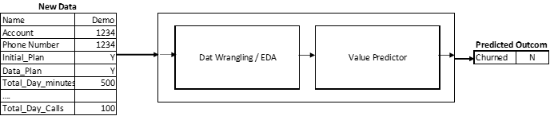

# ML-Deployment-Overview
Machine Learning Deployment General Overview 

The following are the Steps:

1. Create, Validate and Train the Model
2. Save the Model
3. Deploy the Model

Model Example: Telco Churn Example

Model Formats:

  Spark and scikit-learn formats supported are:
  
    •	Spark MLWritable: it is a standard model storage format included with Spark but limited to use only within Spark.
    
    •	Pickle: a standard python serialization library used to save models from scikit-learn
    
    •	PMML: (Predictive Model Markup Language) is a standardized language used to represent predictive analytic (g logistic Regression and feedforward neural networks) models in a portable text format.
    
    •	ONNX: (Open Neural Network Exchange) provides a portable model format for deep learning using Google Protocol Buffers for the schema definition.
    
    
Model Training Options:

    •	Batch Training Model:

        o	Batch Training model is the most commonly used for training model.  Where a machine learning algorithm is trained in a batch or batches on the available data. Once this data is updated or modified, the model can be trained again if need.
    
    •	Real-Time Training Model:

        o	Real Time Training Model involves a continuous process of taking new data and updating the model’s parameters (e.g., the coefficients) to improve its predictive power.
    
        o	It can be achieved with Spark Structured Streaming using StreamingLinearRegressionWithSGD
    
Model Deployment Options:

    •	Batch Model Scoring:

        o	As per above example, it will useful for Business to know which clients are likely to churn so that trigger a retention process to retain the customers.  The retention process is email campaign then Batch process is the best option.
    
    •	Real-time Model Serving:

        o	Online Scoring with Kafka and Spark Streaming: A scalable messaging platform like Kafka to send newly acquired data to a long running Spark Streaming process. The Spark process can then make a new prediction based on the new data and update the operational database.
    
        o	Web Service / REST API:

                	Real time prediction using current data. his API will accept a request with JSON data, pass the data to the function that contains the model, and return a predicted response
        
Monitoring Model Performance:
 
    o	Model Drift: Data can change over time. This can result in poor and degrading predictive performance in predictive models that assume a static relationship between input and output variables.
 
    o	This problem of the changing underlying relationships in the data is called concept drift in the field of machine learning.

